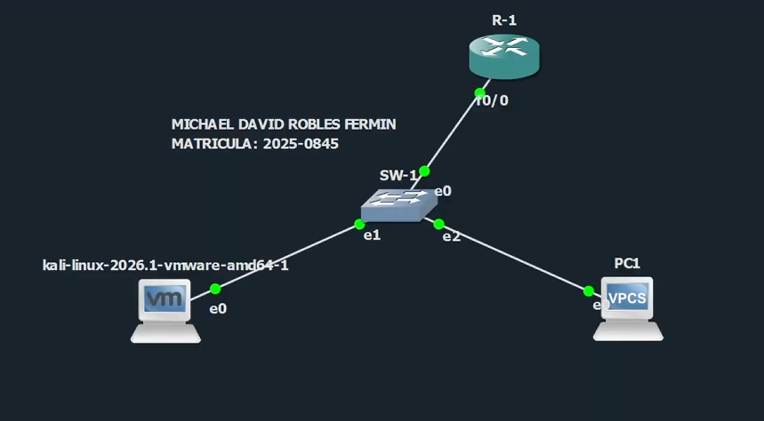
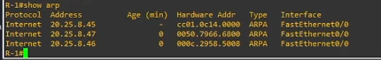
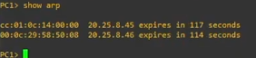
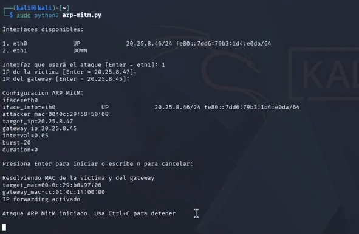
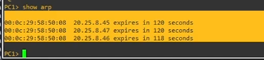
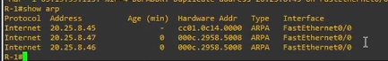
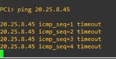
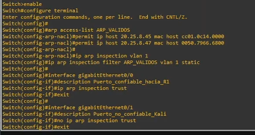

# Ataque ARP MitM – Guía How-to


## Información del proyecto

| Campo | Detalle |
|---|---|
| Laboratorio | Ataque Man-in-the-Middle mediante ARP Spoofing |
| Autor | Michael David Robles Fermín / iClexi |
| Matrícula | 2025-0845 |
| Repositorio | https://github.com/iClexi/ARP-MITM-Attack |
| Video demostrativo | https://www.youtube.com/watch?v=DnInpZtWHs0 |
| Documentación técnica | [docs/documentacion-tecnica-profesional.pdf](docs/documentacion-tecnica-profesional.pdf) |

## Aviso de uso responsable

Este repositorio fue desarrollado únicamente con fines educativos, académicos y de laboratorio controlado. El script debe ejecutarse solamente en redes propias, laboratorios autorizados o entornos virtuales como GNS3, EVE-NG o PNETLab.

No debe utilizarse en redes públicas, empresariales o de terceros sin autorización explícita.

## Objetivo del laboratorio

Demostrar cómo un atacante conectado a la misma red local puede realizar un ataque **ARP MitM** para colocarse entre una víctima y su gateway, logrando observar, redirigir o afectar el tráfico que pasa entre ambos dispositivos.

## Objetivo del script

El script `arp-mitm.py` automatiza el envenenamiento ARP entre la víctima y el gateway. Para lograrlo, envía respuestas ARP falsas indicando que la IP del gateway pertenece a la MAC de Kali y que la IP de la víctima también pertenece a la MAC de Kali.

El script permite seleccionar la interfaz atacante, definir la IP de la víctima, definir la IP del gateway, resolver direcciones MAC, activar IP forwarding y mantener el envío de paquetes ARP falsificados durante la ejecución del laboratorio.

## Topología utilizada



| Dispositivo | Rol | Interfaz | Dirección IP | Dirección MAC relevante |
|---|---|---|---|---|
| R-1 | Gateway | FastEthernet0/0 | `20.25.8.45/24` | `cc01.0c14.0000` |
| SW-1 | Switch capa 2 | e0/e1/e2 | N/A | N/A |
| Kali | Atacante | eth0 | `20.25.8.46/24` | `000c.2958.5008` |
| PC1 | Víctima | e0 | `20.25.8.47/24` | `0050.7966.6800` |

## Requisitos previos

- Laboratorio en GNS3 o entorno equivalente.
- Kali Linux con Python 3.
- Permisos de superusuario en Kali.
- Víctima y gateway en la misma red local.
- Conectividad de capa 2 entre Kali, PC1 y R-1.
- Repositorio clonado en Kali.

## Instalación y preparación

Clonar el repositorio:

```bash
git clone https://github.com/iClexi/ARP-MITM-Attack.git
cd ARP-MITM-Attack
```

Verificar Python:

```bash
python3 --version
```

Ejecutar el script con privilegios de administrador:

```bash
sudo python3 arp-mitm.py
```

## Estado inicial antes del ataque

Antes de ejecutar el script, la tabla ARP del router debe mostrar las asociaciones legítimas. En R-1 se verifica con:

```cisco
show arp
```



En PC1 se verifica con:

```text
show arp
```



En este estado normal, PC1 conoce la MAC real del gateway y R-1 conoce la MAC real de la víctima.

## Ejecución del ataque

Ejecutar el script desde Kali:

```bash
sudo python3 arp-mitm.py
```

Durante la ejecución, el script solicita la interfaz conectada al switch, la IP de la víctima y la IP del gateway. En este laboratorio se utilizan los siguientes valores:

| Parámetro | Valor usado |
|---|---|
| Interfaz atacante | `eth0` |
| IP víctima | `20.25.8.47` |
| IP gateway | `20.25.8.45` |
| Intervalo | `0.05` |
| Burst | `20` |



## Impacto del ataque

Después de iniciar el ataque, PC1 comienza a asociar la IP del gateway con la MAC de Kali. Esto significa que la víctima cree que el atacante es el gateway.

```text
PC1> show arp
```



En R-1 también se observa el envenenamiento ARP, ya que la IP de PC1 aparece asociada a la MAC de Kali.

```cisco
R-1# show arp
```



Esto demuestra que Kali quedó en medio de la comunicación entre PC1 y R-1.

## Demostración de daño con iptables

Para evidenciar que el tráfico pasa por Kali, se bloquea el tráfico ICMP desde PC1 hacia R-1 usando una regla en `iptables`:

```bash
sudo iptables -I FORWARD 1 -s 20.25.8.47 -d 20.25.8.45 -p icmp -j DROP
```


Luego, desde PC1 se intenta hacer ping al gateway:

```text
ping 20.25.8.45
```



El timeout confirma que Kali puede afectar el tráfico reenviado durante el ataque MitM.

## Mitigación aplicada

La contramedida utilizada es **Dynamic ARP Inspection (DAI) con ARP ACL estática**. Esta mitigación permite que el switch valide qué combinaciones IP-MAC son legítimas dentro de la VLAN.

En este laboratorio se autorizan las siguientes asociaciones:

| Dispositivo | IP legítima | MAC legítima |
|---|---|---|
| R-1 | `20.25.8.45` | `cc01.0c14.0000` |
| PC1 | `20.25.8.47` | `0050.7966.6800` |

Configuración aplicada en SW-1:

```cisco
enable
configure terminal

arp access-list ARP_VALIDOS
permit ip host 20.25.8.45 mac host cc01.0c14.0000
permit ip host 20.25.8.47 mac host 0050.7966.6800

ip arp inspection vlan 1
ip arp inspection filter ARP_VALIDOS vlan 1 static

interface gigabitEthernet0/0
description Puerto_confiable_hacia_R1
ip arp inspection trust

interface gigabitEthernet0/1
description Puerto_no_confiable_Kali
no ip arp inspection trust
```



## Verificación de la mitigación

Después de aplicar la mitigación, el ataque puede ejecutarse nuevamente para comprobar que el switch bloquea las respuestas ARP falsificadas. La víctima debe mantener la MAC real del gateway y el router debe mantener la MAC real de PC1.

Comandos de verificación recomendados:

```cisco
show ip arp inspection
show ip arp inspection statistics
show arp access-list
show arp
```

En la víctima:

```text
show arp
```

## Documentación técnica profesional

Para una explicación más completa del laboratorio, incluyendo objetivos, topología, funcionamiento técnico del script, evidencias, análisis del impacto y contramedidas aplicadas, consultar:

[Ver documentación técnica profesional](docs/documentacion-tecnica-profesional.pdf)

Ruta directa: `docs/documentacion-tecnica-profesional.pdf`

## Video demostrativo

La demostración práctica del ataque y su mitigación está disponible en YouTube:

[Ver video del laboratorio en YouTube](https://www.youtube.com/watch?v=DnInpZtWHs0)

URL directa: https://www.youtube.com/watch?v=DnInpZtWHs0

## Conclusión

Este laboratorio demuestra que ARP no valida de forma nativa la identidad de los dispositivos en una red local. Por esta razón, un atacante puede enviar respuestas ARP falsas para colocarse entre una víctima y su gateway.

La mitigación con **Dynamic ARP Inspection y ARP ACL estática** permite bloquear asociaciones IP-MAC no autorizadas, evitando que Kali suplante al gateway o a la víctima. Esta práctica confirma la importancia de aplicar controles de capa 2 en switches de acceso para proteger la red contra ataques Man-in-the-Middle.

## Autor

Este laboratorio fue realizado y documentado por:

**Michael David Robles Fermín**  
**iClexi**  
Matrícula: **2025-0845**

Repositorio: https://github.com/iClexi/ARP-MITM-Attack
